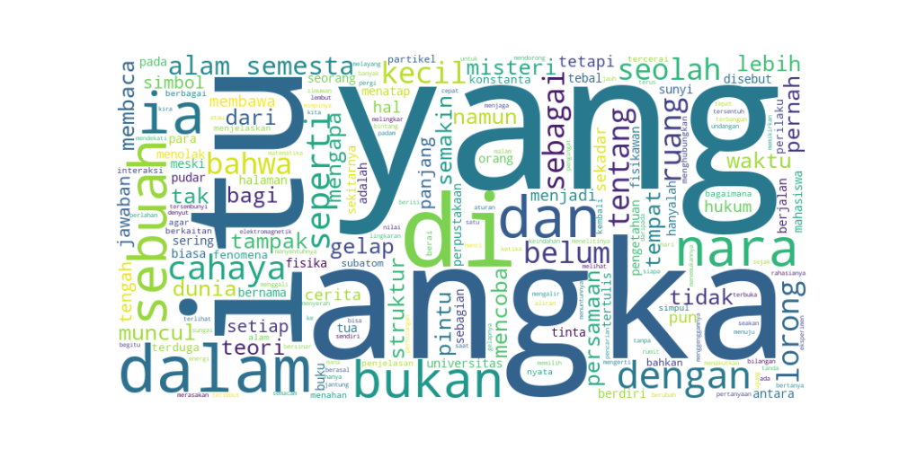

# Word Cloud Generator

This project contains a Python script for generating a simple character-based word cloud from a text file.

## Overview

The project includes:

1. **wordcloud_generator.py**
   Reads a text file, extracts alphabetic characters, and renders them onto a PNG image at random positions.

2. **wordcloud_hdata.txt**
   Serves as the input text source for generating the word cloud.

---

## How It Works

- The script reads *wordcloud_hdata.txt*.
- Only alphabetic characters (A–Z, a–z) are processed.
- Each character is drawn onto a white canvas using random placement.
- The result is saved as **output.png**.

---

## Input Example (wordcloud_hdata.txt)

This is an example text for generating a simple word cloud.
Numbers like 123 will be ignored.
Only letters are displayed.

---

## Output Example

The program generates an image similar to this structure:

- Randomly positioned letters
- Uniform font size
- White background
- Saved as: **output.png**



---

## Usage

1. Install the required library:
   ``` bash
   pip install pillow
   ```
   
3. Place your text inside
   ``` bash
   wordcloud_hdata.txt
   ```

5. Run the script:
   ``` bash
   python wordcloud_generator.py
   ```

6. Check the generated `output.png` file.

---

## Notes

- Digits and symbols are ignored by design.
- You can extend the script to include digits or create a more advanced word cloud.
- Canvas size, font size, and layout randomness can be modified inside the script.
